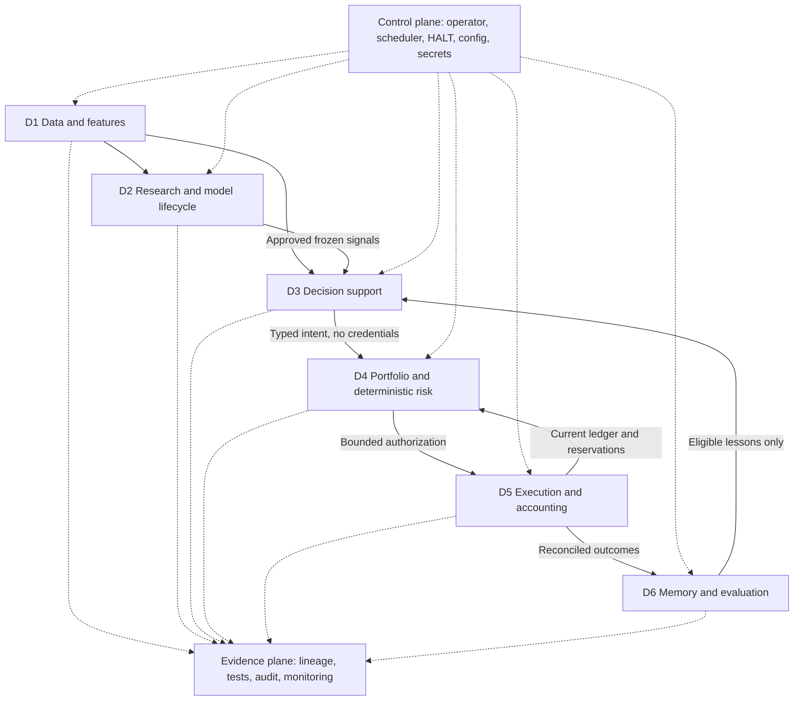
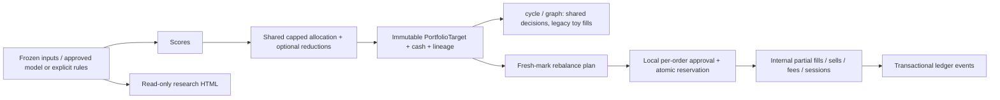
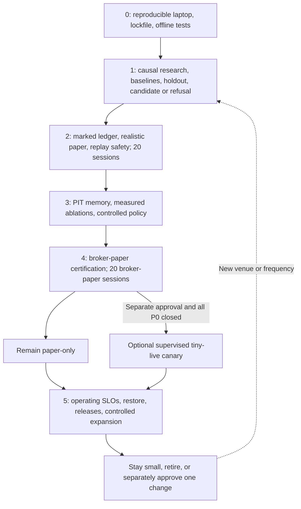
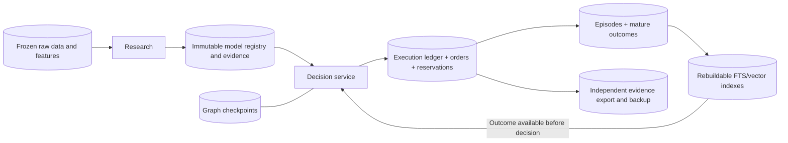
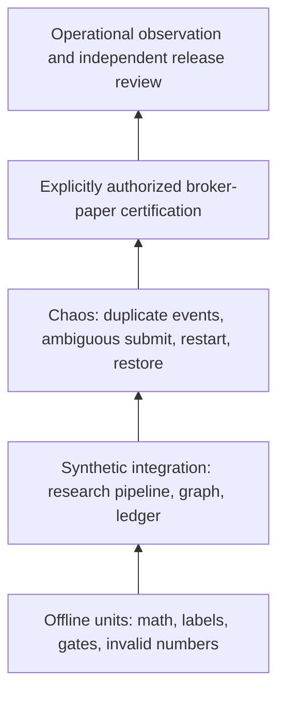

# Trading Desk v3 — visual guide

These diagrams describe **target responsibilities**, not proof that every box is implemented. The [architecture capability register](trading-agents-architecture.md) is authoritative for current status.

## 1. Domains and cross-cutting controls

LLM routing is an optional adapter inside decision support/reflection. Storage and frameworks are implementations of domain interfaces, not mandatory layers. Laptop deployment remains one Python package and one writer.

## 2. Target authority and economic-effect boundary

```mermaid
flowchart LR
  S["Dated data + current model + reconciled portfolio"] --> P["Deterministic proposal"]
  P --> A["Schema, provenance and citations"]
  A --> R["Projected risk + reservation"]
  R --> H["Human approval bound to intent hash"]
  H --> V["Expiry + fresh risk + HALT recheck"]
  V --> O["Durable outbox and stable order ID"]
  O --> B["Paper broker first; live optional"]
  B --> Q["Reconcile fills, fees, cancels and cash"]
  Q --> M["Matured outcome + lesson"]
  B -->|Ambiguous submit| U["UNKNOWN: stop new risk and reconcile"]
  U --> Q
```

Current graph ends at a toy local book; it has no outbox/broker/reconciliation service. HALT blocks new risk and is not a flatten command.

## 3. Implemented portfolio and simulator paths

The internal simulator is not a broker adapter. Its local reviewer string is not authentication, and manually supplied marks/fills are not a venue feed. Cash preservation and shared allocation do not prove backtest/execution equivalence. The original packaged PDFs predate this implementation update; the Markdown capability register is the current source of truth.

## 4. Evidence-gated phases

Calendar windows are minimum operating observations, not proof of alpha. Failed research does not bar simulator engineering; it bars real model/live admission. Phase 5 has a 30-day operational evidence floor, plus restore/rollback drills.

## 5. State ownership

Checkpoint recovery does not authorize a new economic effect. Rebuildable indexes cannot replace a ledger. Outcome updates cannot rewrite the entry situation.

## 6. Test pyramid

Current automated tests cover only portions of the first two levels. Use [testing and acceptance](testing-and-acceptance.md) for unmet obligations. Mermaid can be viewed in GitHub, Obsidian or an editor with Mermaid support; no binary slide deck is required.
